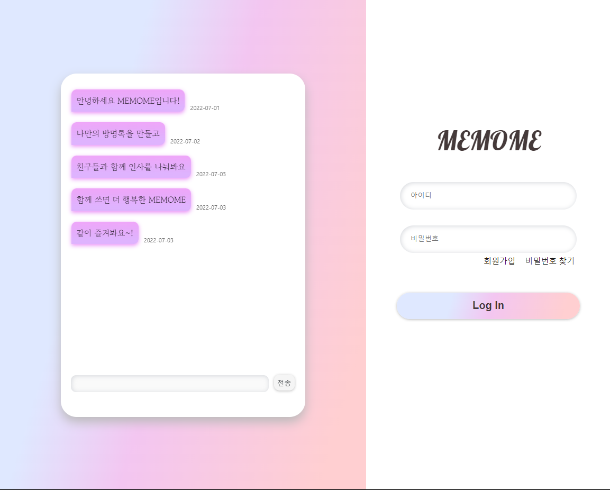
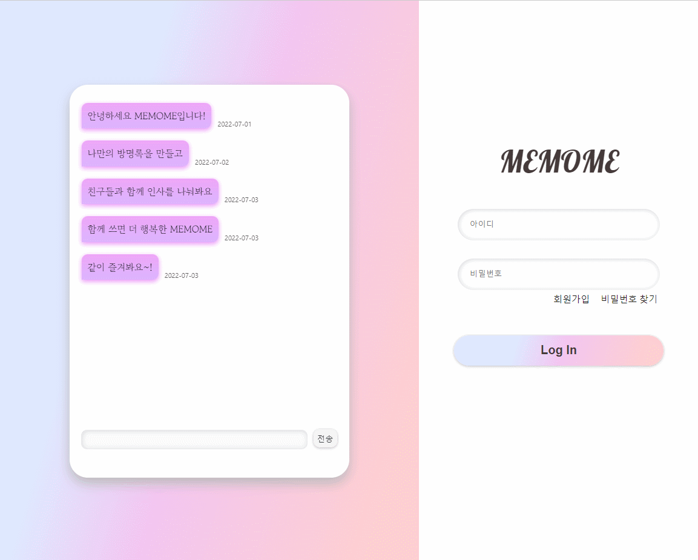
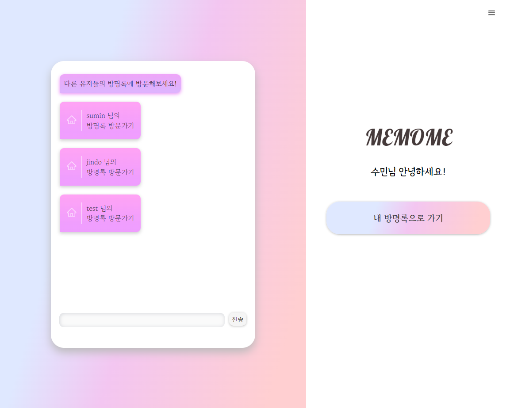
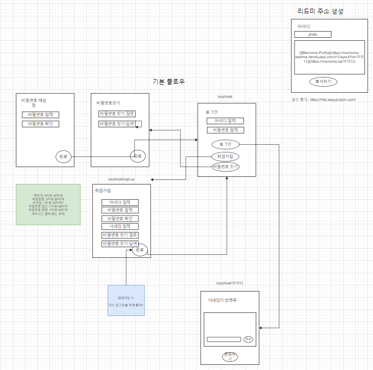
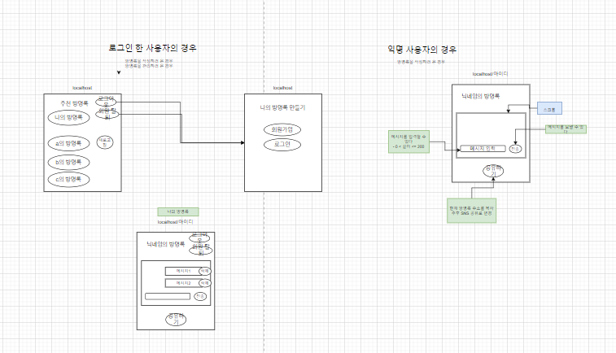

# MEMOME - frontend

> 방명록

## 실행

```shell
npm install

npm run start:dev // dev 서버로 실행

npm run start:prod // prod 서버로 실행
```

`localhost:3000` 접속

## 사용

- React
- CSS3 & HTML
- javascript

## 목차

- [기능](#기능)
- [구현](#구현)
- [트러블 슈팅](#트러블-슈팅)

---

## 기능

### 반응형

화면 사이즈에 따라 구성 변화

| 반응형                  |
| ----------------------- |
|  |

### User 관련 기능

| 로그인                | 로그아웃               | 회원가입               | User 정보 재설정              |
| --------------------- | ---------------------- | ---------------------- | ----------------------------- |
|  |  |  |  |

### 댓글 기능

| 방명록 댓글 작성              | 방명록 댓글 삭제              |
| ----------------------------- | ----------------------------- |
|  |  |

### 방명록 랜덤 추천 기능

| 방명록 랜덤 추천       |
| ---------------------- |
|  |

---

## 구현

### 레이아웃(구글 DRAW.IO 참고)

- 기본 레이아웃
  

- 익명 유무에 따른 레이아웃 분리
  

### 파일별 역할

**src/components/util**

| 파일명(or 함수명) | 역할                                          |
| ----------------- | --------------------------------------------- |
| `AuthRoute.js`    | 로그인 시 메인 페이지로 이동할 수 있도록 체크 |
| `AuthRoute.js`    | 로그인 시 메인 페이지로 이동할 수 있도록 체크 |
| `AuthRoute.js`    | 로그인 시 메인 페이지로 이동할 수 있도록 체크 |

**src/pages**

| 파일명 | 역할        |
| ------ | ----------- |
| `Main` | 메인 페이지 |
| `Main` | 메인 페이지 |
| `Main` | 메인 페이지 |

**src/hooks**

| 파일명     | 역할             |
| ---------- | ---------------- |
| `useAxios` | axios로 api 연결 |
| `useAxios` | axios로 api 연결 |

### 반응형

### 유저 로그인/로그아웃/회원가입/유저 정보 재설정

### 방명록 댓글 작성/ 댓글 삭제 /

### 방명록 랜덤 추천

## 트러블 슈팅

### redux state에 Date가 저장되지 않음

**문제**

**해결**

---

## 학습한 내용

### CORS
