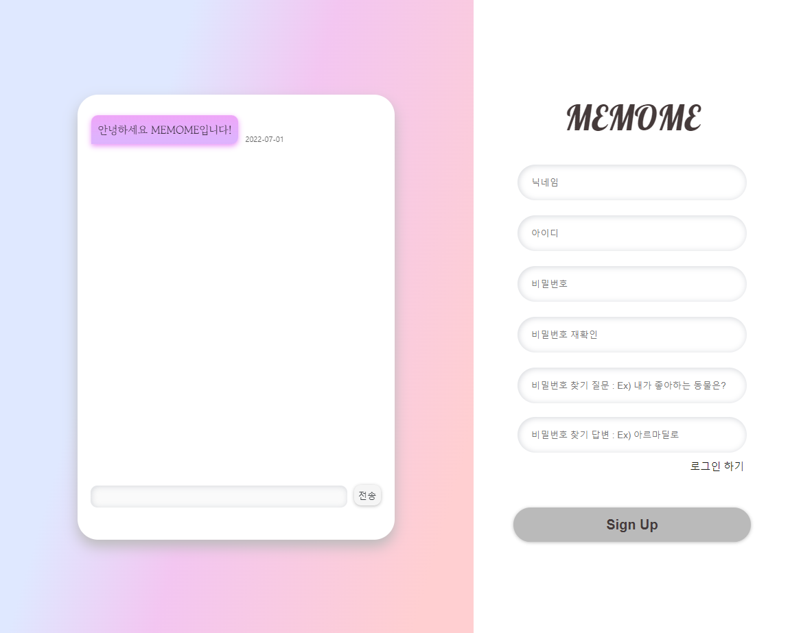

# MEMOME - frontend

> 방명록을 만들고 인사말을 남길 수 있는 웹 어플리케이션

## 실행

```shell
npm install

npm run start:dev // dev 서버로 실행

npm run start:prod // prod 서버로 실행
```

`localhost:3000` : 로컬 접속
`https://memome./be` : 도메인 접속

## 사용

- React
- CSS3 & HTML
- javascript
- github-pages (배포)

## 목차

- [기능](#기능)
- [구현](#구현)
- [트러블 슈팅](#트러블-슈팅)

---

## 기능

### 반응형

화면 사이즈에 따라 구성 변화

| Main 페이지 (웹)        |   방명록 페이지 (웹)          |
| ----------------------- | -------------------------- |
|  |  |

| Main 페이지 (모바일)      | 방명록 페이지 (모바일)          |
| ---------------------------- | ------------------------------- |
|  |  |

### User 관련 기능

| 로그인                | 로그아웃               |
| --------------------- | ---------------------- |
|  |  |

| 회원가입               | User 정보 재설정              |
| ---------------------- | ----------------------------- |
|  |  |

### 댓글 기능

| 방명록 댓글 작성              | 방명록 댓글 삭제              |
| ----------------------------- | ----------------------------- |
|  |  |

### 방명록 랜덤 추천 기능

| 방명록 랜덤 추천       |
| ---------------------- |
|  |

---

## 구현

### 레이아웃(구글 DRAW.IO 참고)

**기본 레이아웃**


**익명 유무에 따른 레이아웃 분리**


### 파일별 역할

**src/components/util**

| 파일명(or 함수명) | 역할                                          |
| ----------------- | --------------------------------------------- |
| `AuthRoute.js`    | 로그인 시 메인 페이지로 이동할 수 있도록 체크 |
| `Comments.js`    | api를 통해 방명록 댓글 가져오는 기능 |
| `DeleteComment.js`    | 방명록 댓글 삭제 |
| `Loading.js`    | api 호출 늦어졌을 때 로딩 화면 나올 수 있도록 설정하는 기능 |
| `Logout.js`    | 로그아웃 기능 |
| `Main.js`    | 로그인 유무에 따른 메인 페이지 구성 변경 기능 |
| `Menu.js`    | 메뉴 기능 |
| `Navigation.js`    | 로그인 유무에 따른 메뉴 구성 변경 기능 ||
| `Withdrawal.js`    | 회원탈퇴 기능 |

**src/pages**

| 파일명 | 역할        |
| ------ | ----------- |
| `Guestbook.js` | 방명록 페이지 |
| `Login.js` | 로그인 페이지 |
| `Signup.js` | 회원가입 페이지 |
| `EnterId.js` | 비밀번호 재설정을 위한 아이디 체크 페이지 |
| `FindPassword.js` | 비밀번호 재설정을 위한 질문 체크 페이지 |
| `ResetPassword.js` | 비밀번호 재설정 페이지 |
| `Profile.js` | 유저 프로필 페이지 |
| `Readme.js` | Readme에 적용할 수 있는 코드 공유 페이지 |

**src/hooks**

| 파일명     | 역할             |
| ---------- | ---------------- |
| `cookie.js` | 쿠키 등록, 삭제, 반환하는 훅 |
| `pwdToken.js` | 비밀번호 재설정 토큰 api 연결 훅 |
| `token.js` | 댓글 삭제 or 회원 탈퇴 시 토큰 유무 판별 및 토큰 연장하는 api 연결 훅 |
| `getNickname.js` | 유저 닉네임 가져오는 api 연결 훅 |
| `getPwdQuestion.js` | 비밀번호 재설정을 위한 질문 가져오는 api 연결 훅 |
| `getPwdQuestion.js` | 비밀번호 재설정을 위한 질문 가져오는 api 연결 훅 |
| `getRandomUser.js` | 로그인 시 메인 페이지에 랜덤으로 유저 추천하는 api 연결 훅 |
| `getUserInfo.js` | 유저 정보 가져오는 api 연결 훅 |
| `getComments.js` | 방명록 댓글 가져오는 api 연결 훅 |

### 반응형
1. media query로 반응형 웹 개발

### 댓글 실시간 전송 구현
1. `useState`를 사용해 초기값을 기존 데이터베이스에 있는 댓글로 설정
2. 댓글 전송 시, 데이터베이스에 새로운 댓글을 추가
3. 추가하면 기존 데이터베이스 값이 변경되는 것을 인지한 useState가 화면에 띄우는 댓글을 새로고침 없이 바꿈


## 트러블 슈팅

### CORS 에러

**문제**
- api 연결 시, CORS 에러가 발생

**해결**
- 서버와 클라이언트 주소가 일치하지 않아 발생한 에러로 판단
- `Package.json에서 Proxy`에 주소를 설정하여 cors에러 해결 -> 하지만 dev 서버에서만 가능하고 실제 배포된 서버로 했을 시 CORS에러가 뜸 
- => 조사해보니 localhost로 서버를 띄울 때만 가능한 방법
-  `backend`에서 다음과 같이 CORS 설정하여 해결
```
app.use(
  cors({
    origin: "https://memome.be/",
    methods: "OPTION, GET, POST, DELETE, PUT",
    credentials: true,
   })
)
```
- 정리 : https://ksumin-dev.tistory.com/121

### useEffect와 axios를 같이 사용할 때 무한루프 에러 발생

**문제**
- 구현 목표 : 댓글을 쓰면 새로고침없이 댓글이 바로 화면에 수 있도록 바꾸는 기능 구현
- 내가 생각한 방법 : useEffect를 써서 comment가 새로 들어올 때마다 업데이트
- 문제 발생 : 원하는 부분이 화면상에는 잘 구현되었지만 백엔드 터미널을 보니 무한 루프로 돌아감. 

**해결**
- 무한루프의 원인은 useEffect 함수 내에서 setState함수를 호출했기 때문이었음 => useEffect 실행 → setState 실행으로 state 변경 → useEffect 실행 (무한루프)
- 종속성 배열로 해결하는 방법이 있었지만 기능 특성 상 댓글 전송시 실시간으로 화면에 보여줘야해서 이와 같은 해결은 처음 화면을 렌더링할때만 실행되어 맞지 않는 해결방안임.
- setState를 useEffect 내부에 넣지않고 이벤트 함수에 넣어주는 방법을 선택
- onSubmit함수와 댓글 불러오는 함수를 따로 두었던 부분을 아예 onSubmit함수안에 댓글 불러오는 axios를 넣기로 결정하여 문제 히결함
- 정리 : https://ksumin-dev.tistory.com/123

---

## 학습한 내용

### CORS
- CORS는 추가 HTTP 헤더를 사용하여 한 출처에서 실행 중인 웹 애플리케이션이 다른 출처의 선택한 자원에 접근할 수 있는 권한을 부여하도록 브라우저에게 알려주는 체제
