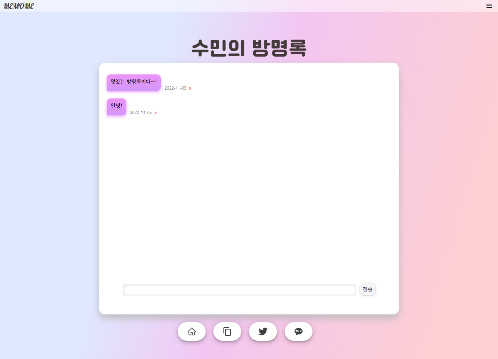

# MEMOME - frontend

> 방명록을 만들고 인사말을 남길 수 있는 웹 어플리케이션

## 실행

```shell
npm install

npm run start:dev // dev 서버로 실행

npm run start:prod // prod 서버로 실행
```

`localhost:3000` : 로컬 접속
`https://memome./be` : 도메인 접속

## 사용

- React
- CSS3 & HTML
- javascript
- github-pages (배포)

## 목차

- [기능](#기능)
- [구현](#구현)
- [트러블 슈팅](#트러블-슈팅)

---

## 기능

### 반응형

화면 사이즈에 따라 구성 변화

| Main 페이지 (웹)        |   방명록 페이지 (웹)          |
| ----------------------- | -------------------------- |
|  |  |

| Main 페이지 (모바일)      | 방명록 페이지 (모바일)          |
| ---------------------------- | ------------------------------- |
|  |  |

### User 관련 기능

| 로그인                | 로그아웃               |
| --------------------- | ---------------------- |
|  |  |

| 회원가입               | User 정보 재설정              |
| ---------------------- | ----------------------------- |
|  |  |

### 댓글 기능

| 방명록 댓글 작성              | 방명록 댓글 삭제              |
| ----------------------------- | ----------------------------- |
|  |  |

### 방명록 랜덤 추천 기능

| 방명록 랜덤 추천       |
| ---------------------- |
|  |

---

## 구현

### 레이아웃(구글 DRAW.IO 참고)

**기본 레이아웃**


**익명 유무에 따른 레이아웃 분리**


### 파일별 역할

**src/components/util**

| 파일명(or 함수명) | 역할                                          |
| ----------------- | --------------------------------------------- |
| `AuthRoute.js`    | 로그인 시 메인 페이지로 이동할 수 있도록 체크 |
| `Comments.js`    | api를 통해 방명록 댓글 가져오는 기능 |
| `DeleteComment.js`    | 방명록 댓글 삭제 |
| `Loading.js`    | api 호출 늦어졌을 때 로딩 화면 나올 수 있도록 설정하는 기능 |
| `Logout.js`    | 로그아웃 기능 |
| `Main.js`    | 로그인 유무에 따른 메인 페이지 구성 변경 기능 |
| `Menu.js`    | 메뉴 기능 |
| `Navigation.js`    | 로그인 유무에 따른 메뉴 구성 변경 기능 ||
| `Withdrawal.js`    | 회원탈퇴 기능 |

**src/pages**

| 파일명 | 역할        |
| ------ | ----------- |
| `Guestbook.js` | 방명록 페이지 |
| `Login.js` | 로그인 페이지 |
| `Signup.js` | 회원가입 페이지 |
| `EnterId.js` | 비밀번호 재설정을 위한 아이디 체크 페이지 |
| `FindPassword.js` | 비밀번호 재설정을 위한 질문 체크 페이지 |
| `ResetPassword.js` | 비밀번호 재설정 페이지 |
| `Profile.js` | 유저 프로필 페이지 |
| `Readme.js` | Readme에 적용할 수 있는 코드 공유 페이지 |

**src/hooks**

| 파일명     | 역할             |
| ---------- | ---------------- |
| `cookie.js` | 쿠키 등록, 삭제, 반환하는 훅 |
| `pwdToken.js` | 비밀번호 재설정 토큰 api 연결 훅 |
| `token.js` | 댓글 삭제 or 회원 탈퇴 시 토큰 유무 판별 및 토큰 연장하는 api 연결 훅 |
| `getNickname.js` | 유저 닉네임 가져오는 api 연결 훅 |
| `getPwdQuestion.js` | 비밀번호 재설정을 위한 질문 가져오는 api 연결 훅 |
| `getPwdQuestion.js` | 비밀번호 재설정을 위한 질문 가져오는 api 연결 훅 |
| `getRandomUser.js` | 로그인 시 메인 페이지에 랜덤으로 유저 추천하는 api 연결 훅 |
| `getUserInfo.js` | 유저 정보 가져오는 api 연결 훅 |
| `getComments.js` | 방명록 댓글 가져오는 api 연결 훅 |

### 반응형

### 유저 로그인/로그아웃/회원가입/유저 정보 재설정

### 방명록 댓글 작성/ 댓글 삭제 /

### 방명록 랜덤 추천

## 트러블 슈팅

### redux state에 Date가 저장되지 않음

**문제**

**해결**

---

## 학습한 내용

### CORS
